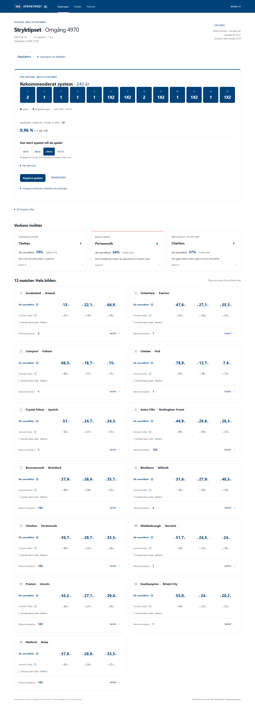

# StryktipsAI

[](https://github.com/AdrianMorenoNystrom/stryktipsAI/actions/workflows/ci.yml)

Ett svenskt analysverktyg för Stryktipset. Jämför marknadens sannolikheter med Svenska Folkets streck, välj budget och få ett rekommenderat system för kupongens 13 matcher.

**[Kom igång](#kom-igång-lokalt)** · **[Driftsättning](#driftsättning)** · **[Dokumentation](#dokumentation)** · **[Rapportera ett problem](https://github.com/AdrianMorenoNystrom/stryktipsAI/issues)**

## Funktioner

- **Aktuell kupong:** riktiga matcher, Svenska Folket, spelstopp och tydliga käll- och tidsangivelser.
- **Marknadsodds:** bookmakerkonsensus från The Odds API när nyckel och tillräcklig täckning finns, annars tydligt märkta fallbacks.
- **System efter budget:** rekommenderade tecken, spikar och garderingar med antal rader, faktisk kostnad och uppskattad chans att täcka 13 rätt.
- **Förklaringar per match:** jämför vår sannolikhet med folkets streck och se systemets val.
- **Historik:** tidsstämplade odds, streck, prognoser, system, facit och utdelningar.
- **Automatisk insamling:** ett separat jobb samlar data även när ingen har webbläsaren öppen.
- **Mobilanpassat gränssnitt:** Kupongen, Analys och Historik, med avancerat underlag bakom detaljval.

<details>
<summary>Visa gränssnittet</summary>



Skärmbilden visar sparad data från verifieringen den 9 september 2026, med Svenska Spel-odds som märkt fallback.

</details>

## Hur sannolikheterna fungerar

Den aktiva modellen är **marknadsbaseline**: `P_model = P_market`. Bookmakeroddsen normaliseras till sannolikheter efter att marginalen räknats bort. Dessa jämförs sedan med Svenska Folkets streck när systemet optimeras.

Projektet innehåller också tränade modellvarianter med bland annat Elo, form och historiska matchdata. I den dokumenterade tidsordnade utvärderingen visade de inte tillräckligt stabil förbättring för att ersätta marknadsbaseline. **Nyheter och streckrörelser ändrar inte den aktiva prognosen.**

Marknadsunderlag väljs i följande ordning:

1. Färsk bookmakerkonsensus med tillräcklig täckning.
2. Senast giltiga konsensussnapshot inom tillåten ålder.
3. Observerade Svenska Spel-odds.
4. Registrerade manuella odds.
5. Saknad marknad — ingen komplett systemanalys.

Svenska Spels odds benämns aldrig bookmakerkonsensus. Standardkravet för konsensus är tre bookmakers. Se [marknadsdefinitioner och kvalitet](docs/market-consensus.md) samt [optimizerbeskrivningen](docs/optimizer.md).

## Teknik

| Del | Implementation |
|---|---|
| Frontend | Angular 21, TypeScript |
| Backend | Python 3.13, FastAPI |
| Lokal lagring | SQLite |
| Produktionslagring | Postgres med versionshanterade migrationer |
| Historiska matchdata | Football-Data, ligorna E0, E1 och E2 |
| Aktuell kupong och streck | Svenska Spels publika kupongflöde |
| Bookmakerodds | The Odds API v4 |
| Drift | Docker, GitHub Pages och GitHub Actions |

Webbläsaren pratar med FastAPI. Backend och insamlingsjobbet hämtar leverantörsdata och skriver till databasen. API-nycklar och databasuppgifter stannar på serversidan.

## Kom igång lokalt

Du behöver **Git, Python 3.13 och Node.js 22 med npm**. Lokal körning använder SQLite och kräver varken Postgres eller oddsnyckel. Modellträning är valfri för att starta appen; utan lokal modellartefakt används marknadsfallback.

### Windows / PowerShell

```powershell
git clone https://github.com/AdrianMorenoNystrom/stryktipsAI.git
cd stryktipsAI

python -m venv .venv
.\.venv\Scripts\python.exe -m pip install -r backend/requirements.lock.txt
npm.cmd --prefix frontend ci

.\start-dev.ps1
```

Startskriptet kör backend och frontend i bakgrunden, skriver loggar till `.logs/` och visar process-ID:n samt stoppkommando. Portarna 8000 och 4200 måste vara lediga.

### macOS / Linux

Efter kloning, från projektroten:

```sh
python3.13 -m venv .venv
.venv/bin/python -m pip install -r backend/requirements.lock.txt
npm --prefix frontend ci
```

Starta backend i en terminal:

```sh
cd backend
../.venv/bin/python -m uvicorn app.main:app --host 127.0.0.1 --port 8000
```

Starta frontend i en annan terminal, från projektroten:

```sh
npm --prefix frontend start
```

Öppna **[appen på localhost:4200](http://127.0.0.1:4200)**. Interaktiv API-dokumentation finns på **[localhost:8000/docs](http://127.0.0.1:8000/docs)**.

Appen försöker hämta aktuell kupong och analyserar den när alla 13 matcher har giltiga underlag. I utvecklingsläge finns även tydligt märkt demo och manuell kupong. **Produktion ersätter aldrig saknad livekupong med demo.**

## Konfiguration

[.env.example](.env.example) beskriver inställningarna. Den är en mall: **`.env` laddas inte automatiskt**. Sätt variabler i processen, din container-host eller GitHub Actions.

| Variabel | Användning |
|---|---|
| `ENVIRONMENT` | `development` som standard; `production` aktiverar produktionskraven |
| `DATABASE_URL` | Privat Postgresanslutning; obligatorisk i produktion |
| `ODDS_API_KEY` | Privat nyckel för bookmakerodds |
| `ODDS_REGIONS` | Oddsregion, standard `uk` |
| `MIN_BOOKMAKERS_FOR_CONSENSUS` | Minsta antal bookmakers, standard `3` |
| `ALLOWED_ORIGINS` | Tillåtna frontend-origins; explicita HTTPS-origins i produktion |
| `API_BASE_URL` | Publik backendadress som används vid frontendens produktionsbygge |
| `ADMIN_API_TOKEN` | Valfri privat token för skyddade ändringar i delade data |
| `STRYKTIPS_LIVE_ENABLED` | `false` stänger av automatisk livehämtning |
| `NEWS_PROVIDER` | Tomt som standard; separat, valfri nyhetsfunktion |

Databasuppgifter, oddsnycklar och administratörstoken ska aldrig checkas in eller läggas i Angular-konfigurationen. Utan oddsnyckel kan giltiga Svenska Spel-odds fortfarande användas; bookmakerkonsensus är då inte aktiverad.

## Driftsättning

Frontend kan publiceras på **GitHub Pages**. FastAPI körs separat på en **container-host**, med **persistent Postgres** för historik och rådata. Att repositoryt är publikt aktiverar inte hosting eller datainsamling automatiskt.

1. Skapa Postgres och konfigurera backendens privata miljövariabler.
2. Bygg Dockerbilden och kör migrationerna före första API-/insamlingsstart.
3. Deploya backend med HTTPS, containerport 8000 och healthcheck `/health`.
4. Sätt GitHub-secrets `DATABASE_URL` och `ODDS_API_KEY` i environment `production`.
5. Sätt repository variables `API_BASE_URL` och `ALLOWED_ORIGINS`.
6. Välj **GitHub Actions** som källa under **Settings → Pages**.
7. Kör verifiering, manuell insamling och Pages-deployment i [Actions](https://github.com/AdrianMorenoNystrom/stryktipsAI/actions).

För detta repository är Pages-origin `https://adrianmorenonystrom.github.io`; repository-sökvägen ska inte ingå i `ALLOWED_ORIGINS`. Workflow hanterar frontendens base path och hash-routing.

**[Fullständig deploymentguide](docs/deployment.md)** innehåller kommandon, databasimport, export, backup och felsökning. [Launch checklist](docs/launch-checklist.md) och [verifieringsrapport](docs/implementation-report-v4.md) dokumenterar leveransen den 9 september 2026; de är inte en aktuell driftstatus.

### Supabase och RLS

Backend ansluter direkt till Postgres med `DATABASE_URL`. Om Supabase används enbart som databas kan **Data API stängas av**; denna arkitektur kräver då inte RLS för klientåtkomst. Om tabeller exponeras via Supabases Data API ska de skyddas med RLS och begränsade behörigheter. Se [Supabases säkerhetsguide](https://supabase.com/docs/guides/api/securing-your-api).

Använd direkt databasanslutning eller **session pooling**. Insamlarens databaslås stöder inte transaction pooling.

## Automatisk insamling och historik

[Collect live data](.github/workflows/collect-live-data.yml) triggas var femte minut och kan även startas manuellt. Scriptet avgör om ny insamling behövs utifrån tiden till spelstopp:

| Tid kvar | Intervall |
|---|---|
| Mer än 48 timmar | 6 timmar |
| 24–48 timmar | 2 timmar |
| 6–24 timmar | 1 timme |
| Sista 6 timmarna | 30 minuter |
| Sista 30 minuterna | 5 minuter |

Jobbet sparar streck, marknad, prognoser och system samt hämtar saknade resultat och utdelningar. GitHub Actions kan försenas; ett exakt snapshot vid spelstopp garanteras inte.

Observationer har UTC-tider och referenser till rådata. Prognoser kopplas till sina exakta indata. Historiska slutstreck som hämtas efter spelstopp bakdateras aldrig till förhandsprognoser. Presentation sker i `Europe/Stockholm`.

Från `backend`, med rätt miljövariabler satta:

```powershell
..\.venv\Scripts\python.exe scripts/collect_live_data.py --force
..\.venv\Scripts\python.exe scripts/export_live_dataset.py --output exports/my-export
```

Välj en ny exportkatalog varje gång. Exporten innehåller separata JSONL-tabeller och ett manifest. För fullständig backup inklusive råbytes används Postgresbackup enligt deploymentguiden.

## Historiska data och modellträning

Träning och utvärdering är separata från den löpande insamlingen. Kör hela Football-Data-pipelinen från `backend`:

```powershell
..\.venv\Scripts\python.exe scripts/bootstrap_ml.py
```

Pipelinen hämtar E0/E1/E2, normaliserar historiken och tränar/utvärderar modellvarianterna. Data och modellartefakter skapas lokalt och ingår inte i repositoryt. På macOS/Linux används `../.venv/bin/python` i stället.

Metod, tidsordnad utvärdering, features och läckageskydd beskrivs i [modell- och nyhetsdokumentationen](docs/model-news-v2.md). Nyhetsfunktionen är valfri, har separat konfiguration och påverkar inte liveprognosens sannolikheter.

## Utveckling och tester

Backend, från `backend`:

```powershell
..\.venv\Scripts\python.exe -m pytest -q
```

Postgresintegrationstester körs när `TEST_DATABASE_URL` pekar på en **separat testdatabas**. CI tillhandahåller en isolerad Postgresinstans.

Frontend, från `frontend`:

```powershell
npm.cmd run build
npx.cmd playwright install chromium
npm.cmd run test:e2e
```

Browsertesterna kräver ett körande lokalt API; vissa kontroller använder den tränade modellartefakten. Playwright startar Angular om port 4200 är ledig. [CI-workflow](.github/workflows/ci.yml) testar även produktionsbygget under en repository-sökväg och omladdning med hash-routing.

Den [dokumenterade verifieringen den 9 september 2026](docs/implementation-report-v4.md) omfattar 110 backendtester och 16 browsertester. Aktuella CI-resultat finns i [Verify](https://github.com/AdrianMorenoNystrom/stryktipsAI/actions/workflows/ci.yml).

Efter ett manuellt produktionsbygge kan lokal frontendkonfiguration återställas från `frontend`:

```sh
node scripts/configure-production.mjs --development
```

## Dokumentation

| Dokument | Innehåll |
|---|---|
| [Deployment](docs/deployment.md) | Hosting, secrets, migrationer, backup och drift |
| [Marknadskonsensus](docs/market-consensus.md) | Eventmatchning, konsensus A/B, kvalitet och fallback |
| [Svenska Spel-provider](docs/svenska-spel-provider.md) | Fältmappning, tidsgränser, historik och resultat |
| [Optimizer](docs/optimizer.md) | Budget, profiler, kombinationer och objective |
| [Modell och nyheter](docs/model-news-v2.md) | Träning, utvärdering och separat news foundation |
| [UI/UX-specifikation](stryktipset-ui-ux-spec.md) | Gränssnittets principer och komponenter |

Tidigare utvecklings- och verifieringsrapporter: [grundversion](docs/implementation-report.md), [modellutvärdering](docs/implementation-report-v2.md), [livekupong och historik](docs/implementation-report-v3.md) samt [produktionsförberedelser](docs/implementation-report-v4.md).

## Bidra

Buggrapporter, förbättringsförslag och pull requests är välkomna. Beskriv hur felet kan återskapas och bifoga relevant felmeddelande utan nycklar, tokens eller databasuppgifter. Vid ändringar i prognoser eller optimizer, dokumentera metod och verifiering.

## Begränsningar

Svenska Spels publika flöde är odokumenterat och kan ändras. Bookmakerutbud, API-kvoter och hämtningstid påverkar marknadstäckningen; livekonsensus är inte garanterat identisk med historiska Football-Data-genomsnitt.

Beräknad chans till 13 rätt bygger på att matcherna behandlas som oberoende. Optimizer tar inte hänsyn till framtida utdelning, och positivt spelvärde är inte bevis på lönsamhet. Ingen kontointegration, spelinlämning eller betalning ingår.

**Oberoende analysverktyg. Ej anslutet till eller godkänt av Svenska Spel.**
