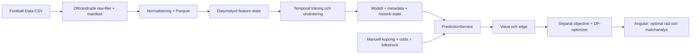

# Arkitektur och vidareutbyggnad

Vid projektstart fanns enbart `stryktipset-ui-ux-spec.md`. Ingen frontend, backend, databas, package manager eller miljökonfiguration fanns att återanvända. Specifikationen lästes före implementation och har bevarats.



## Lagring och körning

All historik lagras lokalt i immutable CSV-snapshots och härledda Parquet-filer. Modellbundle och utvärderingsresultat ligger i `backend/artifacts/`. Dessa genererade, potentiellt stora filer ignoreras av Git och återskapas med pipeline-kommandot. Python-versioner, seed och datasetets SHA-256 finns i modellmetadata. Pythons och npm:s låsfiler gör installationen reproducerbar.

FastAPI har ingen ML- eller optimizerlogik i route-funktionerna. `PredictionService` läser modellbundle med tillhörande historik-state, övervakar filversionen och returnerar provenance för varje prognos. Produktionsmodellens träningsslut är en hård gräns: datum inom träningshistoriken får marknadsfallback, så deploymentmodellen inte av misstag används till framtidsläckande backtest. Lagsökningen använder samma aliasmapp som normaliseringen och inference.

Angular har routes `/overview`, `/coupon`, `/analysis` och `/history`. En typad signal-store hanterar API-anrop, senaste lyckade analys och manuella val. Versionsräknare ignorerar gamla svar vid snabba budget- eller teckenändringar. Kostnadslogik och optimizer finns enbart i Python. Matchdetaljer använder ett native dialog-element för modal fokusfångst och Escape-stängning.

## Temporal integritet

Historiska matchsiffror uppdaterar lagens state först efter att hela datumets features skapats. Samma feature-kod används vid prediction. Imputation och skalning tränas endast på rätt träningsperiod. Opening-odds är explicita marknadsinputs; closing-odds ligger i separata lagrade kolumner och finns inte i featurelistan.

Aktuell säsong används i deploymentträningen men aldrig som sluttest när en avslutad säsong finns. Testresultaten är sekventiella prognoser med frysta modellvikter och löpande uppdaterad historik. Detaljerade splitperioder och kalibreringsbin kan inspekteras i metadata.

## Snapshots och framtida News Intelligence

Inputschemat har separata `oddsSnapshot` och `crowdSnapshot` med:

```text
recorded_at  när observationen registrerades
valid_at     när uppgiften gällde enligt källan
source       var observationen kom ifrån
```

UI:t fyller `recorded_at` vid manuell analys. Eftersom det inte känner källans giltighetstid lämnas `valid_at` null. Football-Data-original får käll-URL, hash och hämtningstid i manifestet. Historiska odds har `odds_valid_at = null`; matchdatum får inte fabriceras som oddsets observationstid.

MVP:n lagrar inte en tidsserie av manuella kupongsnapshots. Nästa datalager kan lägga till append-only tabeller för odds/folket utan att ändra prognos- eller coupon-kontrakten. En framtida point-in-time join måste välja senaste observation med `recorded_at <= prediction_cutoff`, och respektera `valid_at` samt källans tillgänglighet.

Skadepåverkan, rotationsrisk, lineupstyrka och nyhetsscore kan tillföras som ett separat feature-provider-steg före modellträning och inference. Då krävs versionerat featureschema, sparade källor och observationstider, ett gemensamt tränings-/inferencekontrakt och nytt temporalt test. Ingen tom nyhetsmodell eller fabricerad nyhetsdata har lagts in nu.

Nästa steg är en tillförlitlig kupong-/folket-/oddsintegration med snapshots, följt av en tidsstämplad News Intelligence-pipeline. Dessa signaler ska jämföras mot den befintliga marknadsbaselinen innan de påverkar systemvalen.
